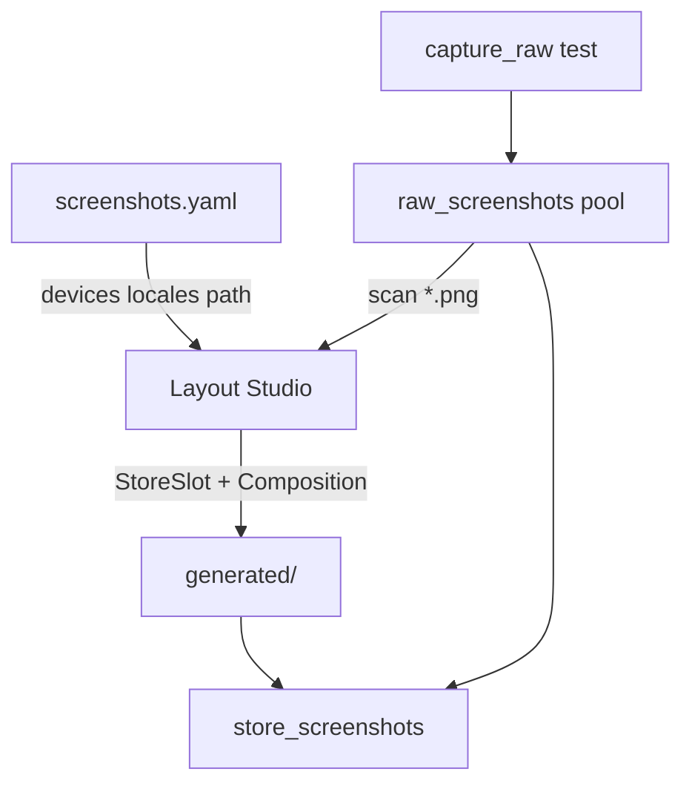

# Architecture

## GUI-only store slots + raw pool



## Package layout

```
lib/
  store_screenshots_generator.dart   # Host / CI public API
  studio.dart                        # Layout Studio extras
  src/
    capture/
    config/
    composition/
    layouts/
    registry/
    scaffold/
    widgets/
bin/
  init.dart
  capture_raw.dart
  export_store_screenshots.dart
example/                  # Minimal host (source only)
```

## Key components

- **`ProjectScaffold` / `init`** — writes yaml + generated stubs + test stubs
- **`runStoreScreenshotExportTests`** — CI export harness
- **`capture_raw`** — shells out to `flutter test` per device/locale
- **`CompositionArtboard`** — render (+ interactive when used by Studio)
- **`CompositionExportCore`** — GUI export loop; CI pumps the artboard via the test runner

## Override resolution

1. `*|device_id|slot_id` — device override
2. `*|*|slot_id` — default (reference: `iphone_15_pro`)
3. Scale via `CompositionScaler` when needed

## Removed

- Legacy `LayoutSpec` / `StoreExportCore`
- Shipping demo raw/store PNG with the package
